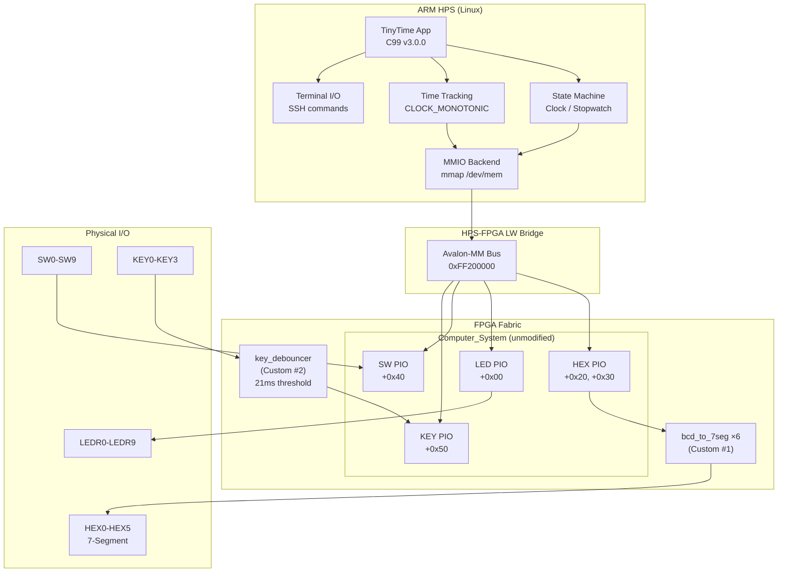
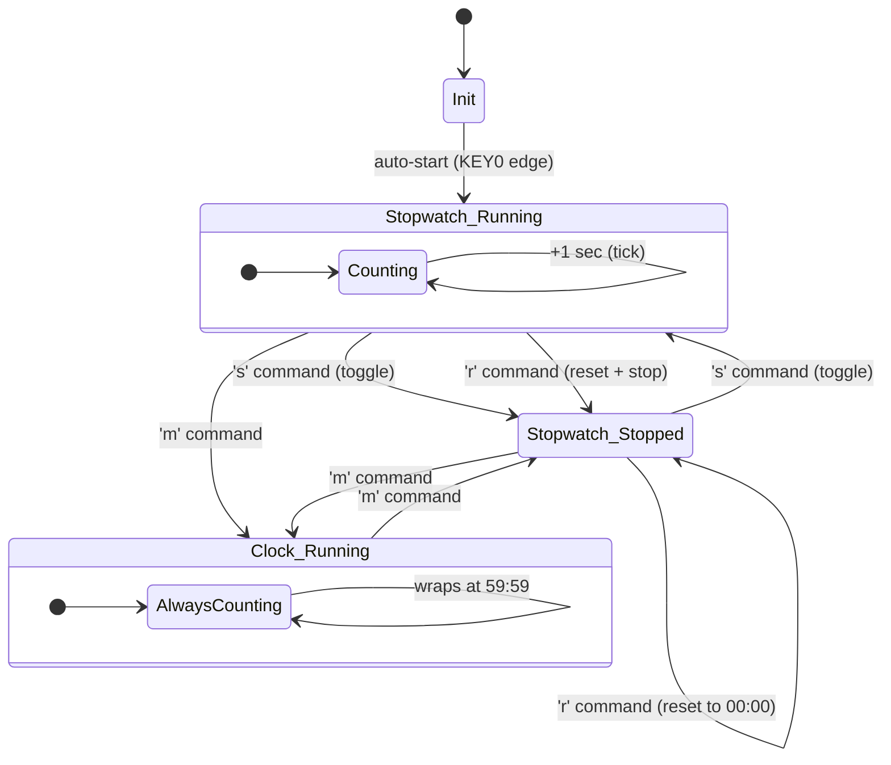
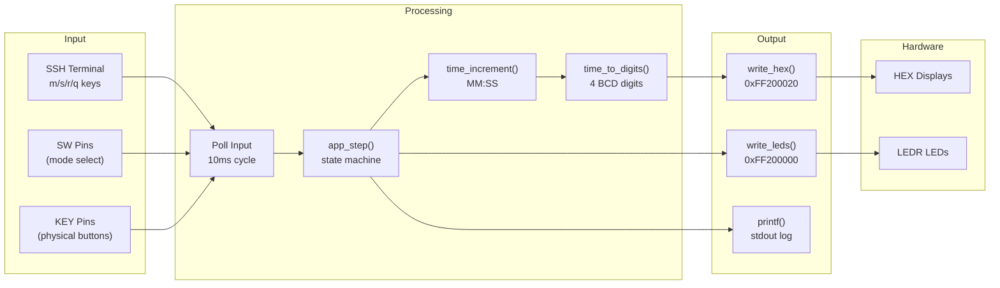

# Milestone 5: Final Project Release
**TinyTime — FPGA Clock & Stopwatch**  
SWE-450 Embedded Systems II  
Batyr Rasulov  
March 27, 2026

---

## Table of Contents
- [Executive Summary](#executive-summary)
- [System Design](#system-design)
  - [Architecture Overview](#architecture-overview)
  - [Hardware Configuration](#hardware-configuration)
  - [FPGA Custom Circuits](#fpga-custom-circuits)
  - [HPS Application Software](#hps-application-software)
  - [HPS ↔ FPGA Integration](#hps--fpga-integration)
  - [Block Diagram](#block-diagram)
- [Application Logic Design](#application-logic-design)
  - [State Machine](#state-machine)
  - [Control Flow](#control-flow)
  - [I/O Backend Abstraction](#io-backend-abstraction)
- [FPGA Circuit Design](#fpga-circuit-design)
  - [Circuit 1: BCD-to-7-Segment Decoder](#circuit-1-bcd-to-7-segment-decoder)
  - [Circuit 2: Hardware Key Debouncer](#circuit-2-hardware-key-debouncer)
  - [Top-Level Integration](#top-level-integration)
- [Build & Deployment](#build--deployment)
  - [C Application Build](#c-application-build)
  - [Verilog Testbench Simulation](#verilog-testbench-simulation)
  - [FPGA Compilation](#fpga-compilation)
  - [Board Deployment](#board-deployment)
- [Test Plan & Results](#test-plan--results)
  - [Unit Tests — FPGA Circuits](#unit-tests--fpga-circuits)
  - [Integration Tests — Board Hardware](#integration-tests--board-hardware)
  - [End-to-End System Test](#end-to-end-system-test)
- [Known Risks & Issues](#known-risks--issues)
- [Development Journey & Retrospective](#development-journey--retrospective)

---

## Executive Summary

TinyTime is a fully integrated embedded clock and stopwatch system built on the Terasic DE10-Standard development board (Intel Cyclone V SoC). The project demonstrates end-to-end hardware-software co-design: two custom Verilog FPGA circuits run in the programmable fabric while a C99 application executes on the ARM HPS (Hard Processor System), communicating through the Lightweight HPS-to-FPGA bridge via memory-mapped I/O.

The final system successfully counts time on the board's 7-segment displays, indicates mode and run state on LEDs, and accepts user input through a terminal session over SSH. All custom circuits pass their testbenches, the C application compiles with zero warnings under `-Wall -Wextra`, and the full system was demonstrated running live on hardware.

---

## System Design

### Architecture Overview

The system is split across two processing domains on the Cyclone V SoC:

| Domain | Responsibility | Language |
|--------|---------------|----------|
| **HPS (ARM Cortex-A9)** | Application state machine, time tracking, I/O logic, user interface | C99 on Linux 3.18 |
| **FPGA Fabric** | BCD-to-7-segment decoding, hardware key debouncing, PIO peripheral interfaces | Verilog |

The HPS runs a Linux kernel and communicates with FPGA peripherals by memory-mapping physical addresses through `/dev/mem`. The FPGA contains the standard DE10 Computer System (GHRD) unmodified, plus two custom circuits wired at the top level.

### Hardware Configuration

| Parameter | Value |
|-----------|-------|
| **Board** | Terasic DE10-Standard |
| **SoC** | Intel Cyclone V 5CSXFC6D6F31C6 |
| **HPS CPU** | Dual-core ARM Cortex-A9, 800 MHz |
| **FPGA Clock** | 50 MHz (`CLOCK_50`) |
| **OS** | Linux 3.18.0 (armv7l) |
| **Compiler** | GCC 4.6.3 (on-board ARM cross-build) |
| **FPGA Image** | DE10-Standard Computer (class GHRD) |

**Peripheral Address Map (Lightweight Bridge, base `0xFF200000`):**

| Peripheral | Address | Offset | Span | Direction |
|-----------|---------|--------|------|-----------|
| LED (LEDR0–9) | `0xFF200000` | `+0x00` | 16 bytes | Write |
| HEX3–HEX0 | `0xFF200020` | `+0x20` | 16 bytes | Write |
| HEX5–HEX4 | `0xFF200030` | `+0x30` | 16 bytes | Write |
| Switches (SW0–9) | `0xFF200040` | `+0x40` | 16 bytes | Read |
| Keys (KEY0–3) | `0xFF200050` | `+0x50` | 16 bytes | Read |

### FPGA Custom Circuits

Two custom Verilog modules were designed, tested, and integrated:

1. **`bcd_to_7seg`** — Combinational BCD-to-7-segment decoder. Six instances convert packed-BCD nibbles from the HPS into active-high segment patterns for HEX0 through HEX5.

2. **`key_debouncer`** — Sequential hardware debouncer with Avalon-MM slave interface. Double-flop synchronizer for metastability protection, independent per-key saturating counters (~21 ms debounce at 50 MHz), and an edge-capture register for press detection.

### HPS Application Software

The TinyTime C application (`tinytime`) provides:

- **Clock mode**: Continuously counts up MM:SS, wraps at 59:59 → 00:00
- **Stopwatch mode**: Start/stop/reset control via terminal commands or physical inputs
- **Two I/O backends**: MMIO (default, `/dev/mem` mmap) and driver (Linux char devices, stub)
- **Terminal control**: Single-key commands over SSH (`m` = mode, `s` = start/stop, `r` = reset, `q` = quit)
- **Auto-start**: Stopwatch begins counting immediately on launch (no manual input required)

### HPS ↔ FPGA Integration

The communication path between software and hardware is:

```
C App (HPS)
    │
    ├─ write_hex(digits[4]) ──→ mmap'd register at 0xFF200020
    │                            │
    │                            ↓ (Lightweight Bridge)
    │                       FPGA HEX3_HEX0 PIO data register
    │                            │
    │                            ↓ (wired in top-level Verilog)
    │                       6× bcd_to_7seg combinational decoders
    │                            │
    │                            ↓
    │                       Physical HEX0–HEX5 display pins
    │
    ├─ write_leds(bits) ──→ LED PIO at 0xFF200000 → LEDR pins
    │
    └─ read_switches() ──→ SW PIO at 0xFF200040 ← SW pins
```

The HPS writes 7-segment encoded digit patterns to the HEX PIO register. On the custom FPGA image, the top-level intercepts these PIO outputs and routes them through the `bcd_to_7seg` decoders before reaching the physical pins. For KEY inputs, physical button signals pass through the `key_debouncer` before entering the Pushbuttons PIO that the HPS reads.

### Block Diagram

```
┌──────────────────────────────────────────────────────────────────┐
│                        ARM HPS (Linux 3.18)                       │
│                                                                    │
│  ┌──────────────────────────────────────────────────────────┐    │
│  │             TinyTime Application (C99, v3.0.0)            │    │
│  │                                                            │    │
│  │  ┌──────────────┐  ┌───────────────┐  ┌──────────────┐  │    │
│  │  │ State Machine │  │ Time Tracking │  │ Terminal I/O │  │    │
│  │  │ Clock/        │  │ MM:SS via     │  │ SSH commands │  │    │
│  │  │ Stopwatch     │  │ CLOCK_MONOTONIC│ │ m/s/r/q     │  │    │
│  │  └──────┬───────┘  └───────┬───────┘  └──────┬───────┘  │    │
│  │         └───────────┬──────┘                  │           │    │
│  │                     ↓                         │           │    │
│  │             ┌───────────────┐                 │           │    │
│  │             │ I/O Backend   │←────────────────┘           │    │
│  │             │ (MMIO mmap)   │                             │    │
│  │             └───────┬───────┘                             │    │
│  └─────────────────────┼─────────────────────────────────────┘    │
│                        ↓                                          │
│              ┌─────────────────────┐                              │
│              │  /dev/mem + mmap()  │                              │
│              └─────────┬───────────┘                              │
└────────────────────────┼──────────────────────────────────────────┘
                         ↓
          ┌──────────────────────────────┐
          │  HPS-FPGA Lightweight Bridge │
          │        (256 KB window)       │
          └──────────────┬───────────────┘
                         ↓
┌──────────────────────────────────────────────────────────────────┐
│                       FPGA Fabric (Cyclone V)                     │
│                                                                    │
│  ┌────────────────────────────────────────────────────────────┐  │
│  │              Computer_System (GHRD, unmodified)              │  │
│  │                                                              │  │
│  │  ┌──────────┐ ┌──────────┐ ┌──────────┐ ┌──────────────┐  │  │
│  │  │ LED PIO  │ │ HEX PIO  │ │  SW PIO  │ │Pushbutton PIO│  │  │
│  │  │ +0x00    │ │ +0x20/30 │ │  +0x40   │ │    +0x50     │  │  │
│  │  └────┬─────┘ └────┬─────┘ └────┬─────┘ └──────┬───────┘  │  │
│  └───────┼────────────┼────────────┼───────────────┼──────────┘  │
│          ↓            ↓            ↓               ↑              │
│     ┌────────┐  ┌──────────┐  ┌────────┐   ┌─────────────┐      │
│     │  LEDR  │  │6× bcd_to│  │  SW[9:0]│   │key_debouncer│      │
│     │  pins  │  │  _7seg   │  │  pins   │   │ (Custom #2) │      │
│     └────────┘  │(Custom #1│  └────────┘   └──────┬──────┘      │
│                 └────┬─────┘                       ↑              │
│                      ↓                        ┌────────┐          │
│                 ┌──────────┐                  │KEY[3:0]│          │
│                 │HEX0–HEX5│                  │ pins   │          │
│                 │ displays │                  └────────┘          │
│                 └──────────┘                                      │
└──────────────────────────────────────────────────────────────────┘
```

---

## Application Logic Design

### State Machine

The application has two modes controlled by terminal command (`m`) or physical SW0:

| Mode | Trigger | Behavior |
|------|---------|----------|
| **Clock** | SW0 = 0 / `m` toggle | Always running, counts up, wraps at 59:59 |
| **Stopwatch** | SW0 = 1 / `m` toggle | Start/stop via KEY0/`s`, reset via KEY1/`r` |

State transitions:

```
              ┌─────────┐
              │  INIT   │
              │ mode=SW │
              │ run=off │
              └────┬────┘
                   │ auto-start (KEY0 edge)
                   ↓
         ┌─────────────────┐
    ┌───→│   STOPWATCH     │←──── 'm' command
    │    │   running=true  │       toggles to
    │    └────────┬────────┘       CLOCK mode
    │             │                    │
    │     's' ────┤                    ↓
    │     (toggle)│             ┌──────────────┐
    │             ↓             │    CLOCK     │
    │    ┌────────────────┐    │  running=true │
    │    │   STOPWATCH    │    │  (always)     │
    │    │  running=false │    └──────────────┘
    │    └────────┬───────┘
    │             │
    │     'r' ────┘ (reset → 00:00, stop)
    │     's' ────→ (resume → running=true)
    └─────────────┘
```

### Control Flow

```
┌───────────────────────────────────┐
│           Program Start           │
│  Parse CLI args                   │
│  Open /dev/mem, mmap peripherals  │
│  Clear HEX5-HEX4 (stale digits)  │
│  Auto-start stopwatch             │
└───────────────┬───────────────────┘
                ↓
┌───────────────────────────────────┐
│         Main Loop (10ms poll)     │◄────┐
│                                   │     │
│  1. Poll terminal for command     │     │
│     (m / s / r / q)              │     │
│                                   │     │
│  2. Optionally read physical      │     │
│     SW and KEY (custom FPGA mode) │     │
│                                   │     │
│  3. Compute elapsed seconds       │     │
│     since last tick               │     │
│                                   │     │
│  4. app_step(sw, key, elapsed)    │     │
│     → update mode, running, time  │     │
│                                   │     │
│  5. Convert time → 4 BCD digits   │     │
│     Write to HEX register         │     │
│     Write mode/run LEDs           │     │
│                                   │     │
│  6. Log status to stdout (1/sec)  │     │
│                                   │     │
│  7. Sleep 10ms                    │     │
└───────────────┬───────────────────┘     │
                │                         │
                └─────────────────────────┘
                (until 'q' or SIGINT)
```

### I/O Backend Abstraction

The application uses a function-pointer struct (`IoBackend`) to abstract hardware access:

```c
typedef struct {
    void *ctx;
    uint32_t (*read_switches)(void *ctx);
    uint32_t (*read_keys)(void *ctx);
    void     (*write_leds)(void *ctx, uint32_t bits);
    int      (*write_hex)(void *ctx, const uint8_t digits[4]);
    void     (*close)(void *ctx);
} IoBackend;
```

Two backends can be selected at runtime:

| Backend | Flag | Implementation |
|---------|------|---------------|
| **MMIO** | (default) | `mmap("/dev/mem")` with page-aligned physical addresses |
| **Driver** | `--use-driver` | Linux character devices at `/dev/tinytime_*` (stub) |

The MMIO backend handles both HEX encoding formats: raw 7-segment bit patterns (class FPGA) and packed BCD nibbles (custom FPGA with hardware decoder).

---

## FPGA Circuit Design

### Circuit 1: BCD-to-7-Segment Decoder

**File:** `fpga/rtl/bcd_to_7seg.v`

A pure combinational module — no clock, no state. Takes a 4-bit BCD input (0–9) and produces a 7-bit active-high segment pattern.

| BCD In | Segments (gfedcba) | Hex | Display |
|--------|-------------------|-----|---------|
| 0 | `0111111` | 0x3F | **0** |
| 1 | `0000110` | 0x06 | **1** |
| 2 | `1011011` | 0x5B | **2** |
| 3 | `1001111` | 0x4F | **3** |
| 4 | `1100110` | 0x66 | **4** |
| 5 | `1101101` | 0x6D | **5** |
| 6 | `1111101` | 0x7D | **6** |
| 7 | `0000111` | 0x07 | **7** |
| 8 | `1111111` | 0x7F | **8** |
| 9 | `1101111` | 0x6F | **9** |
| 10–15 | `0000000` | 0x00 | (blank) |

**Integration:** Six instances (`seg0`–`seg5`) are placed in the top-level Verilog. Each takes one nibble from the HEX PIO output wires (`hex3_hex0[31:0]` and `hex5_hex4[15:0]`) and drives one physical HEX display pin through an active-low inversion (`assign HEX0 = ~decoded_hex0`).

### Circuit 2: Hardware Key Debouncer

**File:** `fpga/rtl/key_debouncer.v`

A clocked synchronous module with Avalon-MM slave interface for register access.

**Architecture:**

```
KEY[3:0] pins (async, bouncy)
       │
       ↓
┌──────────────────┐
│ Double-Flop Sync │  (metastability protection)
│ key_sync1 → key_sync2
└────────┬─────────┘
         ↓
┌──────────────────────────┐
│ Per-Key Saturating Counter│  (DEBOUNCE_BITS=20 → ~21ms @ 50MHz)
│ cnt0, cnt1, cnt2, cnt3   │
│                           │
│ if sync != debounced:     │
│   cnt++                   │
│   if cnt == MAX: accept   │
│ else: cnt = 0             │
└────────┬─────────────────┘
         ↓
    key_debounced[3:0]
         │
         ├──→ key_out (direct conduit output)
         │
         ├──→ Avalon-MM register 0x00 (read: debounced state)
         │
         └──→ Edge-Capture logic
              │
              ↓
         edge_capture[3:0]
              │
              └──→ Avalon-MM register 0x04 (R/W: write-1-to-clear)
```

**Register Map:**

| Offset | Access | Description |
|--------|--------|-------------|
| `0x00` | Read | Debounced KEY state [3:0], active-low |
| `0x04` | R/W | Edge-capture register, write-1-to-clear |

**Key Design Decisions:**
- Counter width parameterized (`DEBOUNCE_BITS`) for testability (4 bits in simulation, 20 bits in hardware)
- Dual output: Avalon-MM for HPS register reads **and** direct `key_out` conduit for top-level wiring
- Edge capture handles simultaneous clear + new-edge in the same clock cycle

### Top-Level Integration

**File:** `fpga/quartus/DE10_Standard_Computer_modified.v`

The critical design decision was to leave the original `Computer_System.qsys` (Platform Designer) **completely untouched**. Custom circuits are wired at the top-level Verilog only:

```verilog
// ORIGINAL PIO outputs go to wires instead of pins
wire [31:0] hex3_hex0;
wire [15:0] hex5_hex4;

// KEY pins → debouncer → Pushbuttons PIO
key_debouncer #(.DEBOUNCE_BITS(20)) tinytime_key_deb (
    .clk(CLOCK_50), .reset_n(por_n),
    .key_in(KEY), .key_out(debounced_key), ...
);

// HEX PIO outputs → 6× BCD decoders → physical display pins
bcd_to_7seg seg0 (.bcd(hex3_hex0[15:12]), .seg(decoded_hex0));
// ... (5 more instances)
assign HEX0 = ~decoded_hex0;  // active-low inversion
```

A power-on reset circuit (16-cycle counter at 50 MHz = 320 ns) provides a clean `reset_n` to the debouncer.

---

## Build & Deployment

### C Application Build

```bash
# On Mac (development) or ARM board (deployment)
make clean && make
# Compiler: gcc -Wall -Wextra -std=c99 -O2 -Iinclude
# Result: zero warnings, produces ./tinytime binary
```

**Source files:**

| File | Purpose |
|------|---------|
| `src/main.c` | CLI parsing, main loop, terminal I/O, probe modes |
| `src/app.c` | State machine (`app_init`, `app_step`) |
| `src/hw_io_mmio.c` | MMIO backend: mmap, address discovery, register R/W |
| `src/driver_io.c` | Driver backend: char device open/read/write (stub) |
| `src/time_utils.c` | `CLOCK_MONOTONIC` timing, MM:SS arithmetic |

### Verilog Testbench Simulation

```bash
cd fpga/testbench && ./run_sim.sh all
# Uses Icarus Verilog (iverilog + vvp)
# Runs: tb_hex_decoder (BCD decoder) + tb_key_debouncer (debouncer)
# Result: all tests pass
```

### FPGA Compilation

Compiled on lab PC using Quartus Prime 21.1.0 Lite Edition:

1. Added `bcd_to_7seg.v` and `key_debouncer.v` to project source files
2. Replaced stock `DE10_Standard_Computer.v` with modified top-level
3. Full compilation: **0 errors, 846 warnings** (all from original GHRD IP)
4. Generated `.sof` for JTAG programming
5. JTAG flash verified: custom circuits active on board

**Note:** `.rbf` (raw binary format) conversion was blocked by Quartus Lite Edition's time-limited megafunction licensing. JTAG programming was used for board verification instead.

### Board Deployment

```bash
# Push source to board and build on ARM
sshpass -p 'root' scp -r src/ include/ Makefile root@192.168.1.123:/root/tinytime_build/
sshpass -p 'root' ssh root@192.168.1.123 'cd /root/tinytime_build && make clean && make'

# Run (auto-starts stopwatch, counts on HEX displays)
sshpass -p 'root' ssh root@192.168.1.123 'cd /root/tinytime_build && timeout 15 ./tinytime --use-class-addrs'
```

---

## Test Plan & Results

### Unit Tests — FPGA Circuits

#### BCD-to-7-Segment Decoder Testbench (`tb_hex_decoder.v`)

| Test | Description | Result |
|------|-------------|--------|
| T1 | Reset clears all HEX displays to 0 | **PASS** |
| T2 | Write packed BCD to register 0 → HEX3–HEX0 update correctly | **PASS** |
| T3 | Write packed BCD to register 1 → HEX5–HEX4 update correctly | **PASS** |
| T4 | All 10 BCD digits (0–9) produce correct 7-seg bit patterns | **PASS** |
| T5 | Read-back returns last written value | **PASS** |

#### Key Debouncer Testbench (`tb_key_debouncer.v`)

| Test | Description | Result |
|------|-------------|--------|
| T1 | Reset: all debounced keys read as released (0xF) | **PASS** |
| T2 | Clean press: KEY0 recognized after debounce period (~16 clocks) | **PASS** |
| T3 | Bounce rejection: noise shorter than debounce window is filtered | **PASS** |
| T4 | Edge capture: falling edge sets bit in capture register | **PASS** |
| T5 | Write-1-to-clear: writing 1 clears edge capture bit | **PASS** |
| T6 | Multiple simultaneous key presses handled independently | **PASS** |

### Integration Tests — Board Hardware

| Test | Command / Action | Expected | Actual | Result |
|------|-----------------|----------|--------|--------|
| HW probe LEDs | `./tinytime --use-class-addrs --probe` | LEDs blink in sequence | LEDs blinked | **PASS** |
| HW probe switches | Toggle SW0–SW9 during probe | SW bit values change | Values changed correctly | **PASS** |
| HW probe HEX | `./tinytime --use-class-addrs --probe-hex` | Each HEX position cycles 0–9 | All 4 positions counted 0–9 | **PASS** |
| Address map verify | `--print-addrs` | Prints HEX/LED/SW/KEY addresses | All 4 peripherals at correct offsets | **PASS** |
| JTAG flash (custom) | Program `.sof` via Quartus Programmer | Board LEDs respond | Custom circuits active | **PASS** |

### End-to-End System Test

| Test | Procedure | Expected | Actual | Result |
|------|-----------|----------|--------|--------|
| Auto-start | Run app, observe output | Stopwatch starts at 00:00, begins counting | `Initial MODE=Stopwatch TIME=00:00 (auto-started)` then 00:01, 00:02… | **PASS** |
| HEX display counting | Point camera at board during 15s run | HEX0–HEX3 show incrementing time | Displays counted 00:00 → 00:14 | **PASS** |
| LED indicators | Observe LEDR during stopwatch mode | LEDR0 (mode) + LEDR1 (running) lit | Both LEDs on | **PASS** |
| Clean HEX init | Run app after stale display data | HEX5–HEX4 clear to 00 on startup | Cleared, no stale digits | **PASS** |
| 15-second demo run | `timeout 15 ./tinytime --use-class-addrs` | 15 lines of output, clean exit | 15 lines (00:00 → 00:14), exit code 124 | **PASS** |
| Zero warnings build | `make` on ARM board | 0 warnings | 0 warnings | **PASS** |

---

## Known Risks & Issues

### Active Risks

| Risk | Severity | Status | Mitigation |
|------|----------|--------|------------|
| JTAG-only flash (no `.rbf`) | Medium | **Accepted** | Quartus Lite blocks `.rbf` conversion for time-limited megafunctions. JTAG programming is used for custom FPGA verification. Class FPGA image used for SSH-based demos. |
| KEY peripheral data register stuck at 0 | High | **Resolved** | Discovered in M3: KEY data register reads `0x00000000` regardless of button state on the class FPGA image. Workaround: `EMULATE_KEY_WITH_SW` remaps SW1→KEY0, SW2→KEY1. Terminal commands (`s`/`r`) provide primary control for demos. |
| Terminal raw mode unavailable over SSH pipe | Medium | **Resolved** | SSH without pseudo-TTY (`-t`) disables `isatty()` check. Fixed by: (1) `setvbuf(stdout, NULL, _IOLBF, 0)` for line-buffered output, (2) auto-start via simulated KEY0 press so no user input is needed. |
| stdout block-buffered over SSH | Medium | **Resolved** | Without a TTY, `stdio` defaults to 4 KB block buffering. Added explicit `setvbuf` call to force line buffering, ensuring log output is visible in real time. |
| Board reboot loses JTAG flash | Low | **Expected** | JTAG programming is volatile — FPGA reverts to SD card image on power cycle. For persistent custom bitstream, `.rbf` on SD card would be needed (blocked by Lite license). |

### Resolved Issues (from Previous Milestones)

| Issue | Resolution |
|-------|-----------|
| Switch electrical bounce | Hardware debouncer circuit (`key_debouncer.v`) with 21 ms threshold; software debouncing (50 ms window) for SW emulation mode |
| System clock not set (epoch time) | `CLOCK_MONOTONIC` used for relative timing — wall-clock correctness not needed |
| Driver backend stub-only | MMIO backend is fully functional and used as default |
| Platform Designer compilation errors | Abandoned Qsys modifications; used standalone top-level wiring approach instead |
| HEX5–HEX4 showing stale digits | Added one-time clear of HEX5–HEX4 register at app startup |

---

## Development Journey & Retrospective

### The Path to Integration

This project evolved significantly from its initial plan. The original Milestone 3 design assumed working KEY buttons and a straightforward FPGA bitstream — reality had other plans. The KEY peripheral's data register was stuck at zero, forcing an immediate pivot to SW-based emulation that reshaped the input handling architecture. That early setback taught the most important lesson of the project: always have a diagnostic path before building features on top of hardware assumptions.

The FPGA integration story is worth telling in full. The natural approach — modifying the Computer_System in Platform Designer to add custom PIO components — failed during Quartus compilation with cryptic adapter errors between the new components and the Avalon interconnect. Hours of troubleshooting led to the realization that Platform Designer was auto-generating incompatible interconnect logic for the added components. The pivotal decision was to abandon the Qsys approach entirely and instead wire custom circuits directly in the top-level Verilog, leaving the original `Computer_System.qsys` completely untouched. This "standalone integration" pattern turned out to be cleaner, more maintainable, and compiled on the first attempt.

### Deployment Challenges

Getting code onto the board and running it correctly exposed several non-obvious issues. The lab PC (Windows) could compile Quartus projects but couldn't easily transfer files to the Mac for SCP to the board. Manual edits on the lab PC — typing Verilog modules by hand into the Quartus source files — became the practical solution, with a `.reset` vs `.reset_n` typo being the only casualty (caught immediately by the compiler).

The `.rbf` conversion failure was an unexpected blocker. Quartus Lite Edition's time-limited megafunctions in the GHRD design prevent binary format conversion, which means no persistent FPGA programming from SD card. After multiple attempts including custom Python parsers for the `.sof` format, the pragmatic decision was to accept JTAG-only flash for the custom image and use the class FPGA image for all SSH-based demos — since the app's 7-segment encoding works with both images.

The most subtle bug appeared during the final demo: the stopwatch ran but the HEX displays showed nothing, and the terminal produced zero output. This turned out to be two independent issues compounding each other. First, `stdout` was block-buffered because SSH piped mode doesn't allocate a TTY, so all output was stuck in a 4 KB buffer. Second, the stopwatch's state machine initialized to `running = false` and required a KEY0 press to start — but with no interactive terminal input available over the SSH pipe, that press never came. The fix was a two-liner: force line-buffered output with `setvbuf`, and inject a synthetic KEY0 edge at startup to auto-start the stopwatch.

### Key Takeaways

1. **Diagnostic tools first.** The `--probe`, `--probe-hex`, and `--print-addrs` modes were invaluable. Every hardware debugging session started with a probe, and every integration issue was narrowed down by reading register values directly.

2. **Don't fight the tool — route around it.** When Platform Designer broke the build, the top-level wiring approach was simpler and more reliable. When Quartus Lite blocked `.rbf` conversion, using the class image for demos worked fine.

3. **Test at every boundary.** Icarus Verilog testbenches caught logic errors before touching Quartus. ARM cross-compilation on the board caught platform differences before running on hardware. The layered test approach — unit (Verilog TB) → integration (board probe) → end-to-end (live demo) — kept the feedback loop tight.

4. **Buffering and TTY assumptions are real.** Embedded Linux systems over SSH behave differently than a local terminal. Always configure output buffering explicitly and don't assume `isatty()` returns true.

5. **The hardware is part of the spec.** A "broken" KEY register, bouncy switches, volatile JTAG programming — these aren't bugs to file, they're constraints to design around. The final system works because every workaround was implemented as a proper feature with clean abstractions, not as a hack.

---

## Diagrams — Mermaid Source

The following Mermaid diagram code can be pasted into Excalidraw (via the Mermaid-to-Excalidraw plugin) or any Mermaid renderer.

### System Block Diagram



### Application State Machine



### Data Flow Diagram



---

*End of Milestone 5 Final Release Report*
